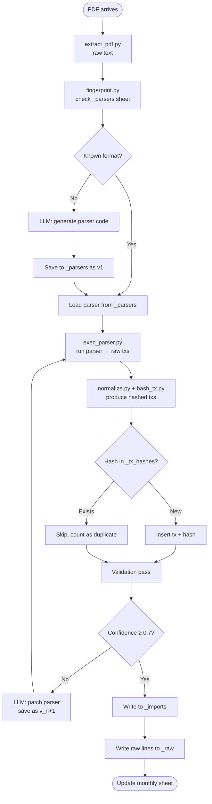
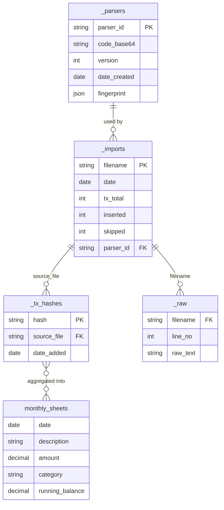

# Architecture

## Agent Decision Loop

```mermaid
flowchart TD
    A([PDF arrives]) --> B[extract_pdf.py<br>raw text]
    B --> C[fingerprint.py<br>check _parsers sheet]
    C --> D{Known format?}

    D -->|Yes| E[Load parser from _parsers]
    D -->|No| F[LLM: generate parser code]
    F --> G[Save to _parsers as v1]
    G --> E

    E --> H[exec_parser.py<br>run parser → raw txs]
    H --> I[normalize.py + hash_tx.py<br>produce hashed txs]
    I --> J{Hash in _tx_hashes?}

    J -->|New| K[Insert tx + hash]
    J -->|Exists| L[Skip, count as duplicate]

    K --> M[Validation pass]
    L --> M

    M --> N{Confidence ≥ 0.7?}
    N -->|No| O[LLM: patch parser<br>save as v_n+1]
    O --> H
    N -->|Yes| P[Write to _imports]
    P --> Q[Write raw lines to _raw]
    Q --> R([Update monthly sheet])
```

---

## Data Model — `family_budget.xlsx`

```mermaid
erDiagram
    _parsers {
        string parser_id PK
        string code_base64
        int    version
        date   date_created
        json   fingerprint
    }

    _imports {
        string filename   PK
        date   date
        int    tx_total
        int    inserted
        int    skipped
        string parser_id  FK
    }

    _tx_hashes {
        string hash        PK
        string source_file FK
        date   date_added
    }

    _raw {
        string filename FK
        int    line_no
        string raw_text
    }

    monthly_sheets {
        date    date
        string  description
        decimal amount
        string  category
        decimal running_balance
    }

    _parsers      ||--o{ _imports      : "used by"
    _imports      ||--o{ _tx_hashes    : "source_file"
    _imports      ||--o{ _raw          : "filename"
    _tx_hashes    }o--o{ monthly_sheets : "aggregated into"
```
